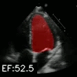
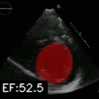
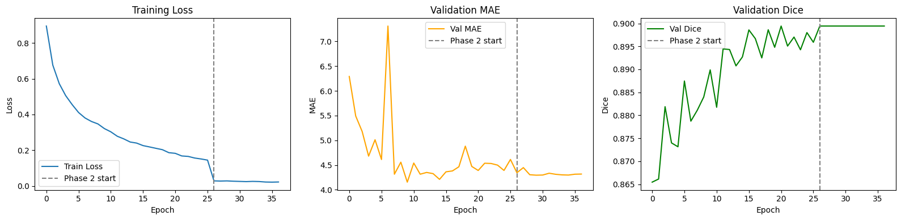
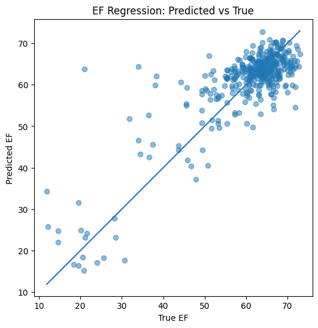
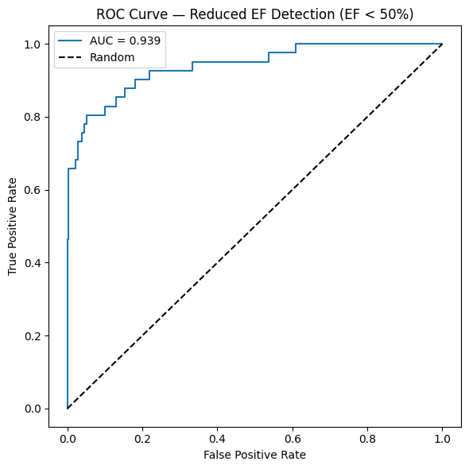
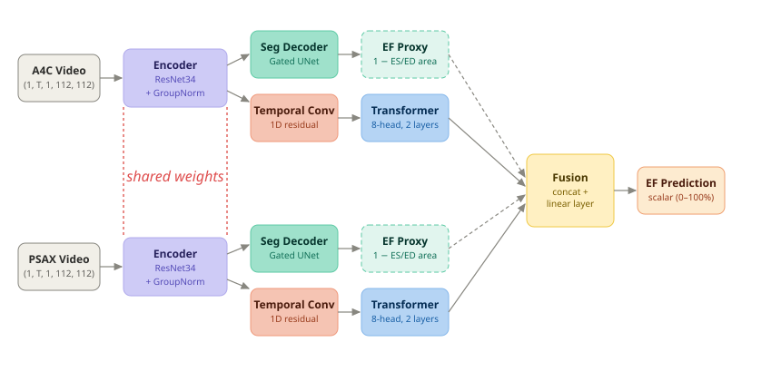

# Dual-View Ejection Fraction Prediction Model

A multi-task deep learning model for left ventricle segmentation and ejection fraction (EF) prediction from pediatric echocardiogram videos. Trained on the EchoNet Pediatric dataset using a dual-view (A4C + PSAX) architecture with a two-phase training strategy.

## Test Metrics
| Metric | Score |
|--------|-------|
| Test MAE | 4.43 |
| Test RMSE | 6.2825 |
| R² | 0.6940 |
| Dice Score | 0.89 |
| AUC | 0.939 |

## Demo

  
  

## Results

<em>Training loss and validation metrics across both training phases</em>

 

<em>Predicted vs actual EF values on the test set</em>

 

<em>ROC curve for reduced EF classification: the model correctly distinguishes low vs normal EF 93.9% of the time (AUC = 0.939)</em>

## Architecture

Both `A4C` and `PSAX` views are processed through a shared `ResNet34` encoder. Each view produces a segmentation mask via a `Gated UNet` decoder and temporal features via a `1D residual conv` and `transformer`. The two streams are fused and passed through a 3-layer MLP for the final EF prediction. 